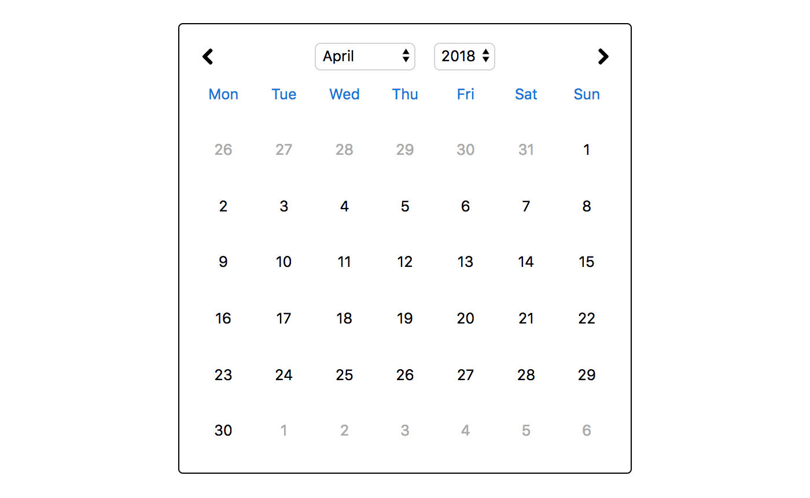

# React Calendar




## Introduction

A calendar built using React that shows all dates in a month in a grid and allows changing the date by using dropdowns for selecting a month and year.


## Project Features

- View built using React
- Date parsing, validation and manipulation using [Moment.js](http://momentjs.com/)
- Overflow dates at the start and end of the month, where applicable
- Dropdown for changing the month
- Dropdown for changing the year
- Previous and next arrows for moving between months
- Defaults to the current calendar month
- Routing and navigation using [React Router](https://reacttraining.com/react-router/)
- URL updates when moving between dates
- Props down, events up data flow


## How to Use

### Develop

```sh
npm start
```

Runs the app in development mode.<br>
Open [http://localhost:3000](http://localhost:3000) to view it in the browser.

The page will automatically reload if you make changes to the code.<br>
You will see the build errors and lint warnings in the console.

### Build

```sh
npm run build
```

Builds the app for production to the `build` folder.<br>
It correctly bundles React in production mode and optimizes the build for the best performance.

The build is minified and the filenames include the hashes.<br>

## Technology Used

What are the primary languages used for this project? Is there a framework in place? E.G.
- [React](https://reactjs.org)
- [Moment](http://momentjs.com/)
- [React Router](https://reacttraining.com/react-router/)


## Contributors

### Development

- [Ashley Davis](https://github.com/ashdavis)
